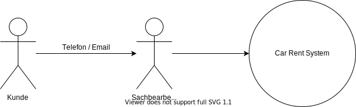
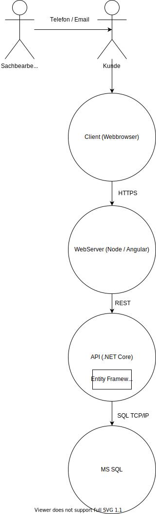
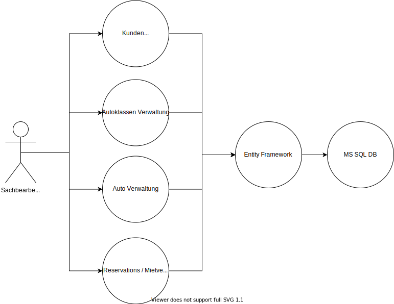
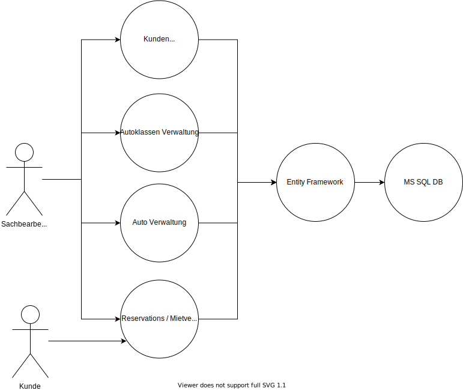
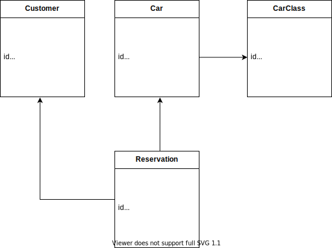

# Vision

## Context


### Was soll gebaut werden?
- Eine Software, mit der ein Sachbearbeiter Kunden und Autos erfassen kann.
- Eine Software, mit der Kunden via Sachbearbeiter Autos für einen gewünschnten Zeitraum reservieren und mieten können.

### Wer benutzt das System?
- Sachbearbeiter
- Kunden indirekt

### Wie passt es in die bestehende IT-Landschaft?
- Es gibt noch keine bestehende IT-Landschaft.

## Containers


### Was sind die technologischen Entscheide?
- Client
    - Angular
- Server
    - ASP.NET Core
    - Entity Framework
    - Testing
        - x-Unit
        - FakeItEasy
- Database
    - Microsoft SQL
- CI/CD
    - GitHub
    - Sonar

### Wie kommunizieren die Container untereinander?
- Client / Server 
    - HTTP REST
- Server / Database
    - Entity Framework (TCP/IP)

## Components


### Aus welchen Komponenten und Services besteht das System?
- Verwaltungen
    - Kundenverwaltung
    - Autoverwaltung (inkl. Autoklassen)
    - Reservations- / Mietvertrags-Verwaltung
- Sämtliche Verwaltungen greifen via EF auf die DB.


### Ist klar wie das System „high-level“ arbeiten soll?
- Beispiel Kunde erfassen:
    - Der Sachbearbeiter kann im Webclient ein Kunde erfassen.
    - Dazu muss er die entsprechenden Daten bei sich im Browser eingeben.
    - Beim Klick auf Speichern wird ein HTTP POST Request mit den entsprechenden Daten im Payload auf die Backend ASP .NET API gemacht.
    - Diese validiert die Daten.
        - Falls ungültig gibt sie ein HTTP Status 400 zurück.
        - Falls gültig erstellt sie im Entity Framework ein neues Objekt und speichert es in der Datenbank.
        - Sobald das Objekt erfolgreich gespeichert wurde gibt die API einen HTTP Status 201 zurück.
        - Die Webapplikation kann dann entsprechend mit einer Erfolgsmeldung darauf reagieren.

# Use Cases im "Brief" Format


## UC1 Der Sachbearbeiter kann Kunden verwalten (CRUD)
- Der Sachbearbeiter kann im Webclient Kunden:
    - Erfassen
        - Felder:
            - Kundennummer
                - Muss einzigartig sein.
            - Vorname
            - Name
            - Strasse
            - Nummer
            - PLZ
            - Ort
            - Land
    - Bearbeiten
    - Löschen
        - Kunden, die bereits eine Reservation, oder einen Mietvertrag besitzen können nicht gelöscht werden. 
        - Sondern diese werden nur als gelöscht markiert.
        - Sobald ein Kunde als gelöscht markiert wurde, kann er keine neuen Reservationen mehr vornehmen.
        - Kunden mit offenen Reservationen können nicht als gelöscht markiert werden.
    - Suchen
        - Kunden sollen über folgende Felder gesucht werden können:
            - Vorname
            - Nachname
            - Kundennummer

## UC2 Der Sachbearbeiter kann Autoklassen verwalten (CRUD)
- Der Sachbearbeiter kann im Webclient Autoklassen:
    - Erfassen
        - Felder:
            - Name
            - Tagesgebühr
    - Bearbeiten
    - Löschen
        - Klassen, die bereits mind. 1 Auto zugewiesen sind können nicht gelöscht werden. 
    - Suchen
        - Klassen sollen über folgende Felder gesucht werden können:
            - Name

## UC3 Der Sachbearbeiter kann Autos verwalten (CRUD)
- Der Sachbearbeiter kann im Webclient Autos:
    - Erfassen
        - Felder:
            - Marke 
            - Typ
            - Autonummer
            - Autoklasse
    - Bearbeiten
    - Löschen
        - Autos, die bereits mind. einem Mietvertrag zugewiesen sind, können nicht gelöscht werden.
        - Sondern sie werden nur als gelöscht markiert.
        - Als gelöscht markierte Autos können nicht erneut reserviert werden.
        - Autos mit offenen Reservationen können nicht als gelöscht markiert werden.
    - Suchen
        - Autos sollen über folgende Felder gesucht werden können:
            - Marke
            - Autnummer

## UC4 Der Sachbearbeiter kann Autos für einen Kunde reservieren
- Über die Auto-Suche (UC3) kann der Sachbearbeiter ein Auto auswählen.
- Nachdem er das Auto ausgewählt hat, kann er ein Start und ein Enddatum der Reservation angeben.
- Sobald er die Anzahl Tage ausgewählt hat, werden ihm die Gesamtkosten für die Reservation angezeigt.
- Beim Klick auf "Reservieren" wird eine neue Reservation angelegt:
    - Felder
        - Reservationsnummer
        - Kunde
        - Auto
        - Startdatum
        - Enddatum

## UC5 Der Kunde kann ein reserviertes Auto abholen
- Am Startdatum kommt der Kunde in die Garage und der Sachbearbeiter klickt bei der entsprechenden Reservation:
    - Mietvertrag generieren
    - Dieser Button wandelt die Reservation in einen Mietvertrag um.
        - Das Reservationsmodel hat ein Flag "Mietvertrag".
        - Dieses wird just in diesem Moment auf true gesetzt.
    - Der Kunde unterzeichnet den Vertrag und kann das Auto mitnehmen.  

# Domain Model


# Views

## Deployment View


## Logical View

## Implementation View

```
|
+---docs
|   |
|   \---images
|
\---source
    |
    +---src
    |   \---CarRentApi
    |       |
    |       +---CarManagement
    |       |   +---Api
    |       |   +---Application
    |       |   +---Domain
    |       |   \---Infrastructure

            +---CustomerManagement
    |       |   +---Api
    |       |   +---Application
    |       |   +---Domain
    |       |   \---Infrastructure
            
            +---ReservationsManagement
    |       |   +---Api
    |       |   +---Application
    |       |   +---Domain
    |       |   \---Infrastructure
    \---tests
        \---CarRentApi.Tests
```